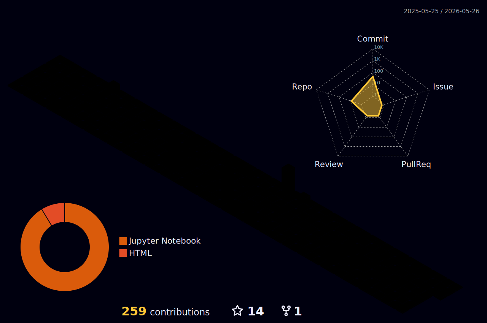

  

  

## 💻 studying...

---
<!--## 🍓 About Me

🎯 **Interests**  
- Frontend Development × HTML × CSS × JavaScript  
- Passionate about crafting beautiful and functional user interfaces  
- Exploring web technologies and constantly learning  

🌙 **Vibes**  
- Favorite Theme: `Gruvbox` + `Night Green`  
- Coding with lo-fi music and a warm cup of tea 🍵 (No coffee here! ☕🚫)  

🧩 **Fun Facts**  
- Loves creating sleek, responsive websites that work seamlessly across devices 📱💻  
- Can debug code while listening to music, but *still* can't stand coffee! 😅

----->

## 📈 GitHub Stats

  
  
  
  
  

---

## 🐍 Snake Animation

  <picture>
    <source media="(prefers-color-scheme: dark)" srcset="https://raw.githubusercontent.com/shiinasama/shiinasama/output/github-snake-dark.svg" />
    <source media="(prefers-color-scheme: light)" srcset="https://raw.githubusercontent.com/shiinasama/shiinasama/output/github-snake.svg" />
    
  </picture>

---

## 🏆 GitHub Trophy Case

  

---

<!--
---

## 🤝 Let's Connect

> Always excited to chat about frontend development, coding, or just say hi 👋

- 📫 [GitHub](https://github.com/Saaatsuki)
- 📸 Ongoing Projects: Responsive websites, JavaScript apps, Interactive UIs

---
-->

<!-- Saaatsuki/Saaatsuki is a ✨ special ✨ repository -->

